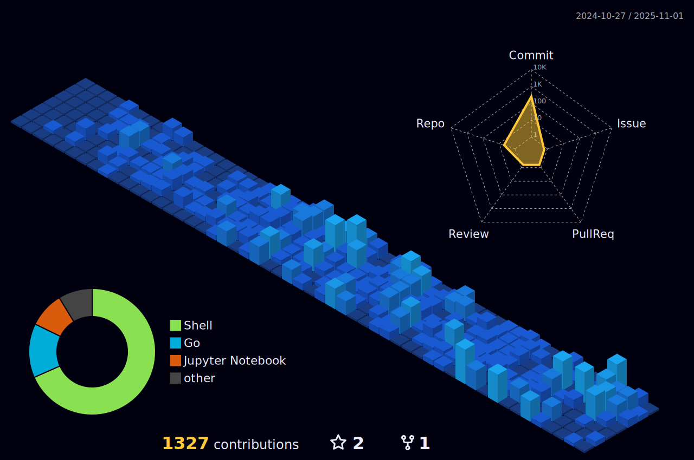

## Hey 👋, I'm Yuri Barsotti!  
  

  

  
  
### Hey, listen! 🧚🏼
I'm a highly inquisitive software engineer driven by a deep passion for exploring cutting-edge technologies. While my expertise lies primarily in backend development, I've cultivated a broad skill set as a full-stack developer.

Beyond my professional pursuits, I immerse myself in creative hobbies such as game development using Godot and honing my skills in pixel art. I'm currently focused on mastering GoLang to expand my programming repertoire.

Outside of tech, I'm an avid coffee enthusiast with a fully equipped setup. I balance my love for staying active through weightlifting, Muay Thai, MMA, and beach tennis. I'm also an e-racing enthusiast and soon-to-be drummer, with a rekindled interest in guitar playing. When I'm not coding or engaging in sports, you'll find me cruising the city on my motorcycle, appreciating clean air, and reconnecting with nature. I'm also a dedicated Final Fantasy fan and former League of Legends player, always up for a gaming session.

🔗 Find more here: https://linktr.ee/yuribarsotti

💻 Public work: https://portfolio-yuribarsotti.vercel.app
   

## Languages and Tools  
<table><tr><td valign="top" width="33%">

### Front-end 

  
  
  
  
  
  
  
  
  
  
  
  

</td><td valign="top" width="33%">

### Back-end  

  
  
  
  
  
  
  
  
  
  
  
  
  
  
  
  

</td><td valign="top" width="33%">

### Others  

  
  
  
  
  
  
  
  

</td></tr></table>  

   

## Github Stats  
<table><tr><td valign="top" width="50%">

</td><td valign="top" width="50%">

  

</td></tr></table>  

   

   

